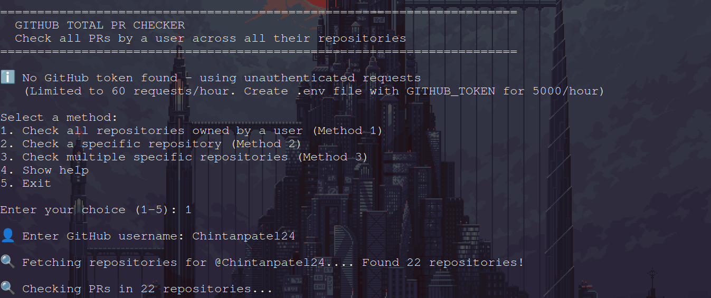
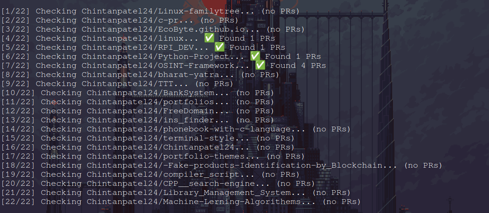
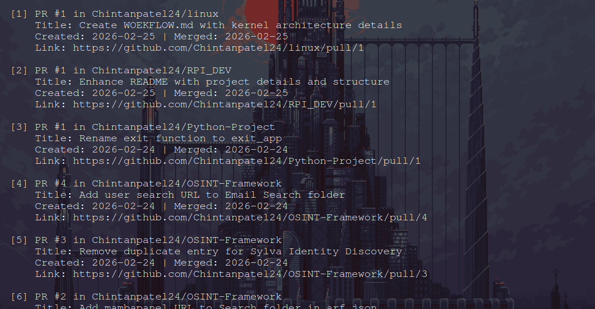

<div align="center">


>## 🚀 A simple Python tool to check all Pull Requests created by a GitHub user across all their repositories.

[](https://www.python.org/downloads/)
[](LICENSE)
[]()

</div>

---

>## 📋 Table of Contents

- [Features](#features)
- [Prerequisites](#prerequisites)
- [Installation](#installation)
- [Usage](#usage)
- [Example Output](#example-output)
- [Limitations](#limitations)
- [Troubleshooting](#troubleshooting)
- [Contributing](#contributing)
- [Key Features Added](#Key-Features-Added)
- [Quick Links](#quick-links)

---

<a name="features"></a>
>## ✨ Features

<table>
<tr>
<td>✅ <b>Zero Dependencies</b></td>
<td>Uses only Python standard library</td>
</tr>
<tr>
<td>✅ <b>No API Token Required</b></td>
<td>Works without authentication</td>
</tr>
<tr>
<td>✅ <b>Comprehensive Statistics</b></td>
<td>Shows merged, pending, and closed PRs</td>
</tr>
<tr>
<td>✅ <b>All Repositories</b></td>
<td>Scans across all user's repositories</td>
</tr>
<tr>
<td>✅ <b>Detailed Reports</b></td>
<td>Optional detailed PR list with links</td>
</tr>
<tr>
<td>✅ <b>Easy to Use</b></td>
<td>Simple command-line interface</td>
</tr>
</table>

---

<a name="prerequisites"></a>
>## 📦 Prerequisites

<div align="left">

| Requirement | Description |
|------------|-------------|
| 🐍 Python | Version 3.6 or higher |
| 🌐 Internet | Active connection |
| 👤 GitHub Username | Valid username to check |

</div>

**That's it! No additional packages needed.**

---

<a name="installation"></a>
>## 🔧 Installation

>### Method 1: Clone the Repository

```bash
# Clone this repository
git clone https://github.com/Chintanpatel24/c-pr.git

# Navigate to the directory
cd c-pr

# Run the script
python3 c-pr.py

```
>### Method 2: Download Directly
1. Download c-pr.py from this repository
2. Save it to your desired location
3. Run it with Python

```bash
python c-pr.py

```
>### Method 3: Quick Download (Using wget or curl)

1. Using wget:

```bash

# Download the script
wget https://raw.githubusercontent.com/Chintanpatel24/c-pr/main/c-pr.py

# Run it
python3 c-pr.py

```

2. Using curl:

```bash

# Download the script
curl -O https://raw.githubusercontent.com/Chintanpatel24/c-pr/main/c-pr.py

# Run it
python3 c-pr.py

```

3. One-Line Install & Run:

```bash

# Download and run in one command
curl -O https://raw.githubusercontent.com/Chintanpatel24/c-pr/main/c-pr.py && python3 c-pr.py

```

---

>## 🔑 Optional: Setup GitHub Token

- For higher API limits (5000 requests/hour instead of 60):

Step 1: Create a Personal Access Token at GitHub Settings

Step 2: Create a .env file in the same directory:

```bash
GITHUB_TOKEN=your_token_here
```

Step 3: The script will automatically detect and use it

---

<a name="usage"></a>
>## 🚀 Usage
- Starting the Tool

```bash

python3 c-pr.py

```



- Main Menu
```

======================================================================
  GITHUB TOTAL PR CHECKER
  Check all PRs by a user across all their repositories
======================================================================

Select a method:
1. Check all repositories owned by a user (Method 1)
2. Check a specific repository (Method 2)
3. Check multiple specific repositories (Method 3)
4. Show help
5. Exit

Enter your choice (1-5):

```

### Method 1: Check All Repositories
Best for: Getting complete PR statistics across all user's repos
```
text

Enter your choice (1-5): 1
👤 Enter GitHub username: Chintanpatel24
```

The script will:

✅ Fetch all repositories owned by the user

✅ Scan each repository for PRs

✅ Display total statistics

✅ Optionally show detailed list or export

### Method 2: Check Single Repository
Best for: Checking PRs in one specific repository
```
text

Enter your choice (1-5): 2

👤 Enter GitHub username: gaearon
🏢 Enter repository owner: facebook
📁 Enter repository name: react
```
The script will:

✅ Check only the specified repository

✅ Show PRs created by the user in that repo

✅ Display statistics

### Method 3: Check Multiple Specific Repositories
Best for: Checking PRs in selected repositories only
```
text

Enter your choice (1-5): 3

👤 Enter GitHub username: gaearon

📁 Enter repositories to check (one per line, format: owner/repo)
   Example: facebook/react
   Enter 'done' when finished:

Repository: facebook/react
Repository: reduxjs/redux
Repository: facebook/create-react-app
Repository: done
```
The script will:

✅ Check only the repositories you specified

✅ Show combined statistics

✅ Display detailed list if requested

- Export Options
After scanning, you can:
```
text

What would you like to do?
1. Show detailed PR list
2. Export to JSON
3. Export to CSV
4. All of the above
5. Exit

Enter your choice (1-5):
```
---

<a name="example-output"> </a>
>## 📊 Example Output



- Scanning Process:
```

======================================================================
  GITHUB TOTAL PR CHECKER
  Check all PRs by a user across all their repositories
======================================================================

🔑 GitHub token detected - using authenticated requests

Select a method:
1. Check all repositories owned by a user (Method 1)
2. Check a specific repository (Method 2)
3. Check multiple specific repositories (Method 3)
4. Show help
5. Exit

Enter your choice (1-5): 1

👤 Enter GitHub username: gaearon

🔍 Fetching repositories for @gaearon.... Found 156 repositories!

🔍 Checking PRs in 156 repositories...

[1/156] Checking gaearon/react... ✅ Found 3 PRs
[2/156] Checking gaearon/redux... ✅ Found 2 PRs
[3/156] Checking gaearon/my-app... (no PRs)
[4/156] Checking gaearon/hooks-demo... ✅ Found 1 PR
[5/156] Checking gaearon/overreacted.io... (no PRs)
...
[156/156] Checking gaearon/test-repo... (no PRs)
Summary Statistics:

======================================================================
📊 TOTAL PR STATISTICS FOR @gaearon
======================================================================

📈 Summary Across All Repositories:
   Total PRs Created: 47
   ✅ Merged (Accepted): 38
   ⏳ Pending (Open): 5
   ❌ Closed (Not Merged): 4

======================================================================
```

- Detailed PR List:
```

======================================================================
✅ MERGED PRs (38):
======================================================================

  [1] PR #12345 in facebook/react
      Title: Fix hooks bug in concurrent mode
      Created: 2024-01-15 | Merged: 2024-01-20
      Link: https://github.com/facebook/react/pull/12345

  [2] PR #789 in reduxjs/redux
      Title: Add TypeScript support for middleware
      Created: 2024-01-10 | Merged: 2024-01-12
      Link: https://github.com/reduxjs/redux/pull/789

  [3] PR #456 in facebook/create-react-app
      Title: Update webpack configuration
      Created: 2024-01-05 | Merged: 2024-01-08
      Link: https://github.com/facebook/create-react-app/pull/456

======================================================================
⏳ PENDING PRs (5):
======================================================================

  [1] PR #999 in facebook/react
      Title: Add new useEvent hook
      Created: 2024-01-25
      Link: https://github.com/facebook/react/pull/999

  [2] PR #888 in reduxjs/redux
      Title: Improve performance for large stores
      Created: 2024-01-22
      Link: https://github.com/reduxjs/redux/pull/888

======================================================================
❌ CLOSED PRs (4):
======================================================================

  [1] PR #111 in facebook/react
      Title: Experimental feature (rejected)
      Created: 2024-01-01 | Closed: 2024-01-03
      Link: https://github.com/facebook/react/pull/111
```

---

<a name="limitations"> </a>
>## ⚠️ Limitations

🔄 GitHub API Rate Limits

<div align="left">
 
| Authentication |	Rate Limit |	Resets After |
|---------------|--------|---------|
| ❌ Without Token	| 60 requests/hour	| 1 hour |
| ✅ With Token	| 5,000 requests/hour	| 1 hour |

---

<a name="troubleshooting"> </a>
>## 🛠️ Troubleshooting


<div align="left">


| Issue |	Solution |
|---------|---------|
| python: command not found |	Use python3 check_pr.py instead |
| HTTP Error 403: rate limit exceeded	| Wait 1 hour or add GitHub token |
| HTTP Error 404: Not Found |	Check if username/repo exists |
| Shows 0 PRs	| User has no PRs or repos are private |
| Script freezes |	User has many repos; wait for completion |
| ModuleNotFoundError	| Ensure Python 3.6+ is installed |

</div>

- Debug Mode:

```bash
# Run with output logging
python check_pr.py 2>&1 | tee output.log

```

---

<a name="contributing"> </a>
>## 🤝 Contributing

### Contributions are welcome! 🎉

- How to Contribute:
```bash

# 1. Fork the repository
# 2. Clone your fork
git clone https://github.com/Chintanpatel24/c-pr.git

# 3. Create a feature branch
git checkout -b feature/AmazingFeature

# 4. Make your changes
# 5. Commit your changes
git commit -m "Add some AmazingFeature"

# 6. Push to the branch
git push origin feature/AmazingFeature

# 7. Open a Pull Request
```

### 💡 Ideas for Contributions:

 1. Add support for GitHub Organizations
 2. Export to Excel format
 3. Create a GUI version
 4. Add data visualization (charts/graphs)
 5. Filter PRs by date range
 6. Add progress bar for large scans
 7. Multi-threading for faster scanning
 8. Add unit tests
 9. Create Docker container
10. Add webhook support for real-time tracking

### 📋 Contribution Guidelines:
1. Follow PEP 8 style guide
2. Add comments for complex logic
3. Update README for new features
4. Keep dependencies minimal (preferably zero)
5. Test on Python 3.6+

---

>## 🔑 Key Features Added 

### 1. 
|---|PR Type Detection (12 types)|---|
|-----------|-------------|--------------|
| 🐛 Bug Fix | ✨ Feature | 📦 Dependency |
| 📚 Documentation | ♻️ Refactor | 🧪 Test |
| ⚡ Performance | 🎨 Style/Lint | 🌐 Translation |
| 🔧 Config | 🔒 Security | 🗑️ Deprecation |

### 2.
|---|Tool Detection (16+ tools)|---|
|-------|----------|----------|
| 🖥️ GitHub Web | 💻 GitHub CLI (gh) | 🔧 Git CLI + API |
| 🤖 Dependabot | 🔄 Renovate Bot | 🛡️ Snyk Bot |
| 💜 VS Code | 🧠 JetBrains IDE | ⚙️ GitHub Actions |

### 3. Productivity/Brain Power Chart :

- Profit-Loss style chart
- Based on time between PRs
- Factors: PR frequency, acceptance rate, consistency
- Shows upward trend (high productivity) or downward trend (low productivity)
- Color-coded: Green = Profit Zone, Red = Loss Zone

### 4. Graph Output :

- Saved as your-graph-by-cp.png
- Dark theme with gradient effects
- 6 different visualizations including the productivity chart
---
<a name="quick-links"> </a>
>## 🔗 Quick Links

<div align="left">
 
|Resource |	Link |
|-------|---------|
|📖 GitHub API Docs	| docs.github.com/en/rest |
|🐍 Python Download |	python.org/downloads |
|🔑 Create GitHub Token	| github.com/settings/tokens |
|📚 Pull Request Guide |	docs.github.com/en/pull-requests |

</div>

---
