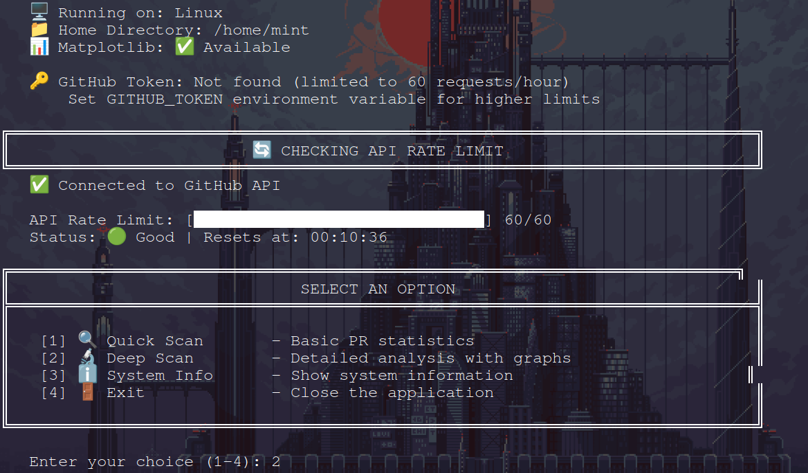
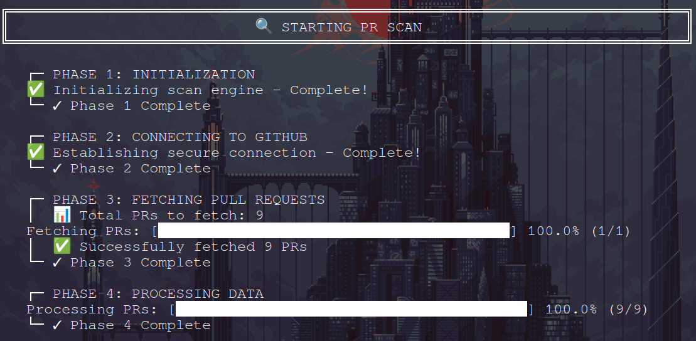
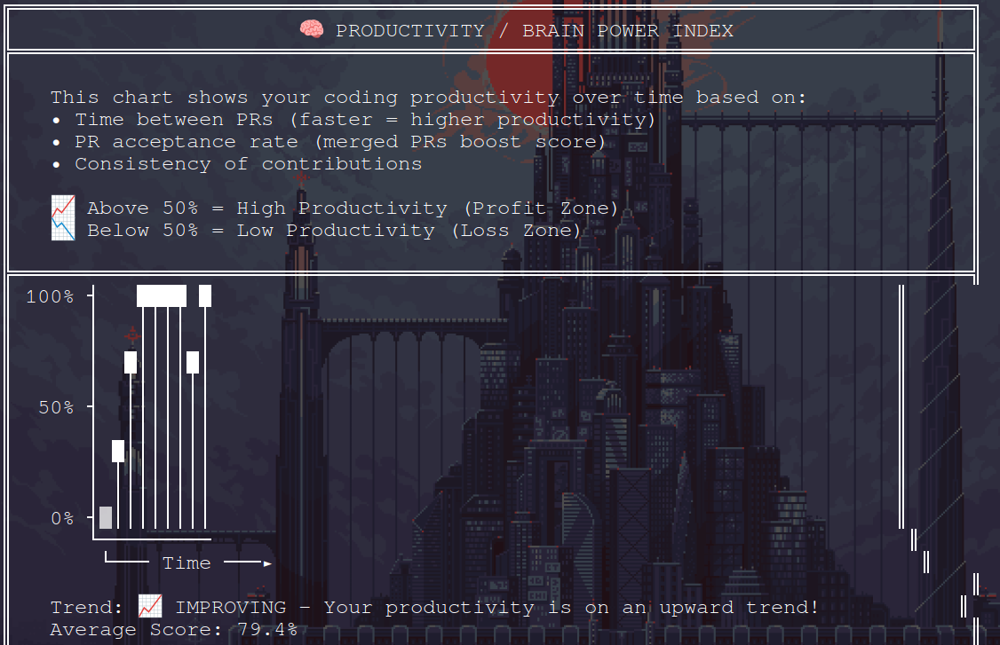

<div align="center">


>## 🚀 A Python tool to check all Pull Requests created by a GitHub user across all their repositories.

[](https://www.python.org/downloads/)
[](LICENSE)
[]()

</div>

---

>## 📋 Table of Contents

- [Features](#features)
- [Prerequisites](#prerequisites)
- [Optional requirement](#requirement)
- [Demo Graph](#graph)
- [Installation](#installation)
- [Usage](#usage)
- [Example Output](#example-output)
- [Limitations](#limitations)
- [Troubleshooting](#troubleshooting)
- [Contributing](#contributing)
- [Key Features Added](#Key-Features-Added)
- [Quick Links](#quick-links)

---

<a name="features"></a>
>## ✨ Features

<table>
<tr>
<td>✅ <b>Zero Dependencies</b></td>
<td>Uses only Python standard library</td>
</tr>
<tr>
<td>✅ <b>No API Token Required</b></td>
<td>Works without authentication</td>
</tr>
<tr>
<td>✅ <b>Comprehensive Statistics</b></td>
<td>Shows merged, pending, and closed PRs</td>
</tr>
<tr>
<td>✅ <b>All Repositories</b></td>
<td>Scans across all user's repositories</td>
</tr>
<tr>
<td>✅ <b>Detailed Reports</b></td>
<td>Optional detailed PR list with links</td>
</tr>
<tr>
<td>✅ <b>Easy to Use</b></td>
<td>Simple command-line interface</td>
</tr>
</table>

---

<a name="prerequisites"></a>
>## 📦 Prerequisites

<div align="left">

| Requirement | Description |
|------------|-------------|
| 🐍 Python | Version 3.6 or higher |
| 🌐 Internet | Active connection |
| 👤 GitHub Username | Valid username to check |

</div>

**That's it! No additional packages needed.**

---

<a name="requirement"> </a>
>## Optional requirement (mandatory to Generate Graphs)

### Installing Matplotlib :

- Matplotlib is a popular Python library for creating static, animated, and interactive visualizations.
- Here's how to install it:

>### Method 1: Using pip (Recommended)

 1. The simplest way is to use pip, Python's package manager:
```bash
pip install matplotlib
```
 2. If you're using Python 3 specifically,you might need:
```bash
pip3 install matplotlib
```
>### Method 2: Using conda

 1. If you're using Anaconda or Miniconda, use conda instead:
```bash
conda install matplotlib
```

>## Verifying the Installation

- After installation, verify it worked by opening Python and importing the library:
```bash
import matplotlib.pyplot as plt
print(matplotlib.__version__)
```
- If no error appears and a version number prints, the installation was successful.

>## Additional Setup Notes :

 1. Virtual Environments (Recommended)
- It's best practice to install packages in a virtual environment to avoid conflicts:
```bash
python -m venv myenv
source myenv/bin/activate  # On Windows: myenv\Scripts\activate
pip install matplotlib
```
 2. System Dependencies
- On some Linux systems, you might need system libraries first. For example, on Ubuntu/Debian:
```bash
sudo apt-get install python3-matplotlib
```
 3. if using pip, ensure you have the development headers:
```bash
sudo apt-get install python3-dev
pip install matplotlib
```

---

<a name="graph"> </a>
>## 📈 Demo Graph 


---

<a name="installation"></a>
>## 🔧 Installation

>### Method 1: Clone the Repository

```bash
# Clone this repository
git clone https://github.com/Chintanpatel24/c-pr.git

# Navigate to the directory
cd c-pr

# Run the script
python3 c-pr.py

```
>### Method 2: Download Directly
1. Download c-pr.py from this repository
2. Save it to your desired location
3. Run it with Python

```bash
python c-pr.py

```
>### Method 3: Quick Download (Using wget or curl)

1. Using wget:

```bash

# Download the script
wget https://raw.githubusercontent.com/Chintanpatel24/c-pr/main/c-pr.py

# Run it
python3 c-pr.py

```

2. Using curl:

```bash

# Download the script
curl -O https://raw.githubusercontent.com/Chintanpatel24/c-pr/main/c-pr.py

# Run it
python3 c-pr.py

```

3. One-Line Install & Run:

```bash

# Download and run in one command
curl -O https://raw.githubusercontent.com/Chintanpatel24/c-pr/main/c-pr.py && python3 c-pr.py

```

---

>## 🔑 Optional: Setup GitHub Token

- For higher API limits (5000 requests/hour instead of 60):

Step 1: Create a Personal Access Token at GitHub Settings

Step 2: Create a .env file in the same directory:

```bash
GITHUB_TOKEN=your_token_here
```

Step 3: The script will automatically detect and use it

---

<a name="usage"></a>
>## 🚀 Usage
- Starting the Tool

```bash
cd c-pr
python3 c-pr.py

```
- Main Menu


---

<a name="example-output"> </a>
>## 📊 Example Output







---

<a name="limitations"> </a>
>## ⚠️ Limitations

🔄 GitHub API Rate Limits

<div align="left">
 
| Authentication |	Rate Limit |	Resets After |
|---------------|--------|---------|
| ❌ Without Token	| 60 requests/hour	| 1 hour |
| ✅ With Token	| 5,000 requests/hour	| 1 hour |

---

<a name="troubleshooting"> </a>
>## 🛠️ Troubleshooting


<div align="left">


| Issue |	Solution |
|---------|---------|
| python: command not found |	Use python3 check_pr.py instead |
| HTTP Error 403: rate limit exceeded	| Wait 1 hour or add GitHub token |
| HTTP Error 404: Not Found |	Check if username/repo exists |
| Shows 0 PRs	| User has no PRs or repos are private |
| Script freezes |	User has many repos; wait for completion |
| ModuleNotFoundError	| Ensure Python 3.6+ is installed |

</div>

- Debug Mode:

```bash
# Run with output logging
python check_pr.py 2>&1 | tee output.log

```

---

<a name="contributing"> </a>
>## 🤝 Contributing

### Contributions are welcome! 🎉

- How to Contribute:
```bash

# 1. Fork the repository
# 2. Clone your fork
git clone https://github.com/Chintanpatel24/c-pr.git

# 3. Create a feature branch
git checkout -b feature/AmazingFeature

# 4. Make your changes
# 5. Commit your changes
git commit -m "Add some AmazingFeature"

# 6. Push to the branch
git push origin feature/AmazingFeature

# 7. Open a Pull Request
```

### 💡 Ideas for Contributions:

 1. Add support for GitHub Organizations
 2. Export to Excel format
 3. Create a GUI version
 4. Add data visualization (charts/graphs)
 5. Filter PRs by date range
 6. Add progress bar for large scans
 7. Multi-threading for faster scanning
 8. Add unit tests
 9. Create Docker container
10. Add webhook support for real-time tracking

### 📋 Contribution Guidelines:
1. Follow PEP 8 style guide
2. Add comments for complex logic
3. Update README for new features
4. Keep dependencies minimal (preferably zero)
5. Test on Python 3.6+

---

<a name="Key-Features-Added"> </a>
>## 🔑 Key Features Added 

### 1. 
|---|PR Type Detection (12 types)|---|
|-----------|-------------|--------------|
| 🐛 Bug Fix | ✨ Feature | 📦 Dependency |
| 📚 Documentation | ♻️ Refactor | 🧪 Test |
| ⚡ Performance | 🎨 Style/Lint | 🌐 Translation |
| 🔧 Config | 🔒 Security | 🗑️ Deprecation |

### 2.
|---|Tool Detection (16+ tools)|---|
|-------|----------|----------|
| 🖥️ GitHub Web | 💻 GitHub CLI (gh) | 🔧 Git CLI + API |
| 🤖 Dependabot | 🔄 Renovate Bot | 🛡️ Snyk Bot |
| 💜 VS Code | 🧠 JetBrains IDE | ⚙️ GitHub Actions |

### 3. Productivity/Brain Power Chart :

- Profit-Loss style chart
- Based on time between PRs
- Factors: PR frequency, acceptance rate, consistency
- Shows upward trend (high productivity) or downward trend (low productivity)
- Color-coded: Green = Profit Zone, Red = Loss Zone

### 4. Graph Output :

- Saved as your-graph-by-cp.png
- Dark theme with gradient effects
- 6 different visualizations including the productivity chart

### 5. Loop-Based Menu :

- Returns to main menu after each operation
- Only exits when user selects option 4

### 6. Properly Aligned Tables :

- All ║ borders are consistent
- Fixed width formatting

---

<a name="quick-links"> </a>
>## 🔗 Quick Links

<div align="left">
 
|Resource |	Link |
|-------|---------|
|📖 GitHub API Docs	| docs.github.com/en/rest |
|🐍 Python Download |	python.org/downloads |
|🔑 Create GitHub Token	| github.com/settings/tokens |
|📚 Pull Request Guide |	docs.github.com/en/pull-requests |

</div>

---
