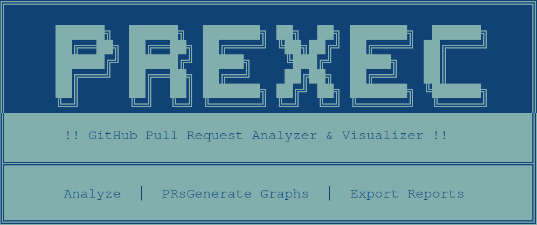

>## check all Pull Requests created by a GitHub user across all their repositories.

---

>## GUI
- NO installation needed : [Tap to use directly ↗](https://prexecgui.netlify.app)
- Make sure that you have entered correct profile name !!

---

>[!NOTE]
>For more : [python-installation.md](python-installation.md)
