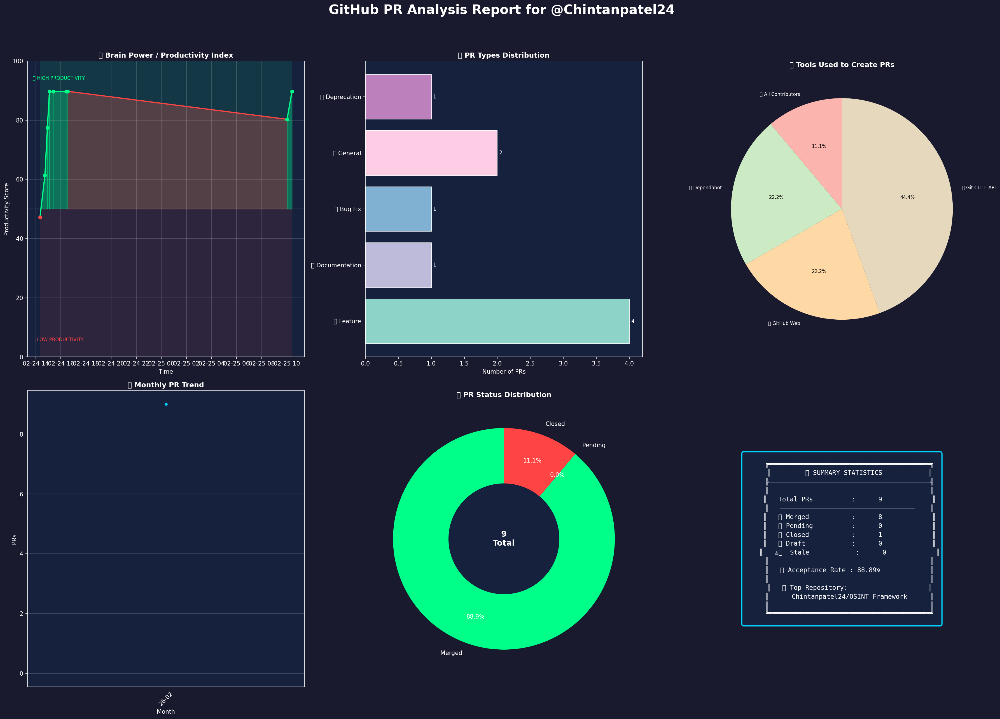
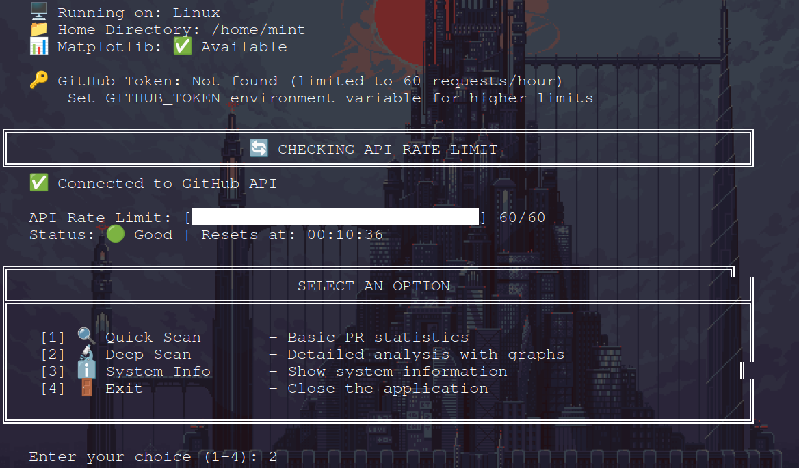
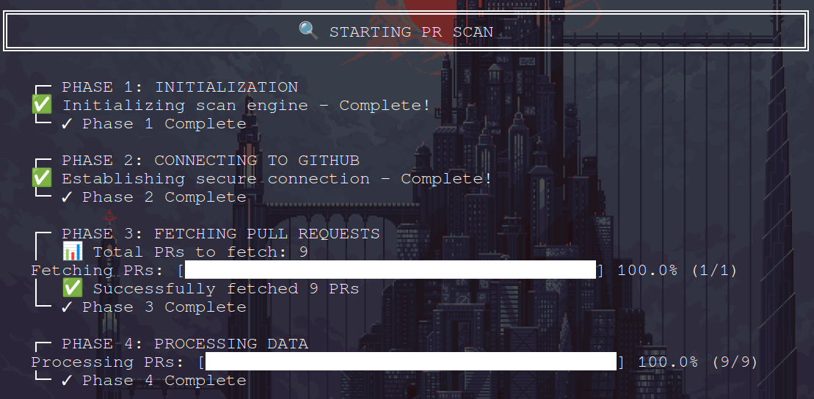
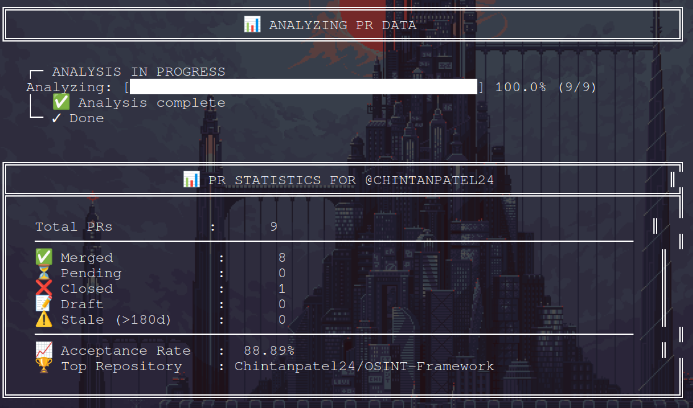
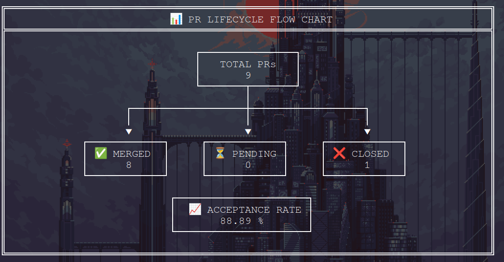
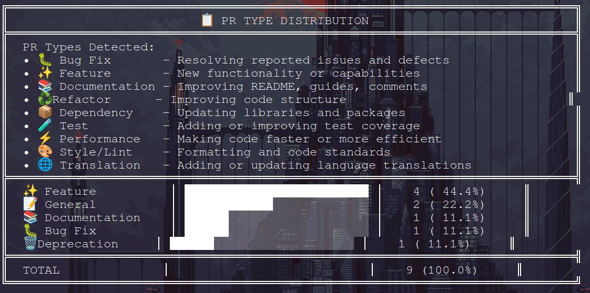
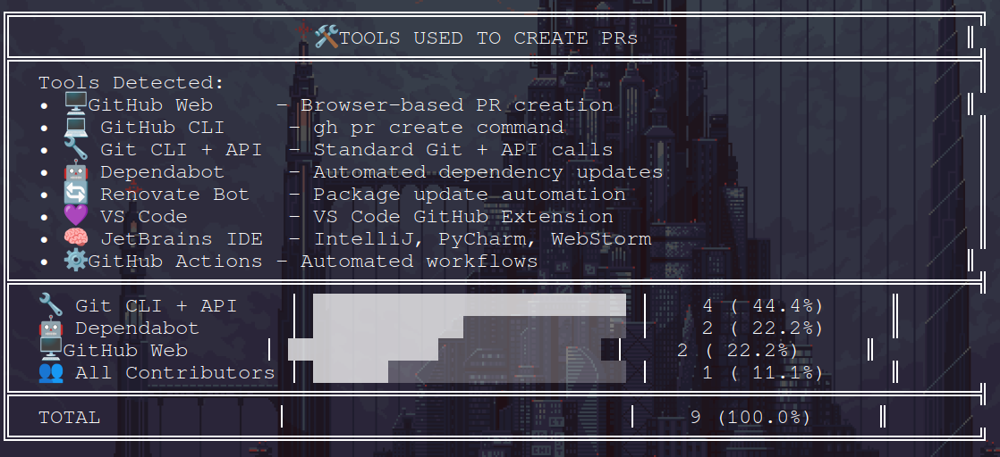
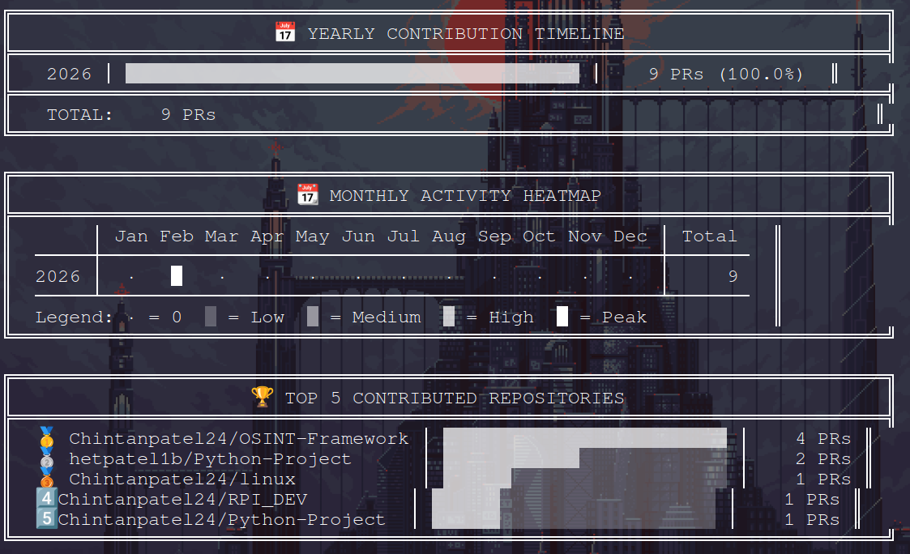

>## Table of Contents

- [Features](#features)
- [Prerequisites](#prerequisites)
- [Optional requirement](#requirement)
- [Installation](#installation)
- [Demo Graph](#graph)
- [Usage](#usage)
- [Limitations](#limitations)
- [Troubleshooting](#troubleshooting)
- [Example Output](#example-output)

---

<a name="features"></a>
>## Features

<table>
<tr>
<td>✅ <b>Zero Dependencies</b></td>
<td>Uses only Python standard library</td>
</tr>
<tr>
<td>✅ <b>No API Token Required</b></td>
<td>Works without authentication</td>
</tr>
<tr>
<td>✅ <b>Comprehensive Statistics</b></td>
<td>Shows merged, pending, and closed PRs</td>
</tr>
<tr>
<td>✅ <b>All Repositories</b></td>
<td>Scans across all user's repositories</td>
</tr>
<tr>
<td>✅ <b>Detailed Reports</b></td>
<td>Optional detailed PR list with links</td>
</tr>
<tr>
<td>✅ <b>Easy to Use</b></td>
<td>Simple command-line interface</td>
</tr>
</table>

---

<a name="prerequisites"></a>
>##  Prerequisites

<div align="left">

| Requirement | Description |
|------------|-------------|
|  Python | Version 3.6 or higher |
|  Internet | Active connection |
|  GitHub Username | Valid username to check |

</div>

**That's it! No additional packages needed.**

---

<a name="requirement"> </a>
>## Optional requirement (mandatory to Generate Graphs)

### Installing Matplotlib :

- Matplotlib is a popular Python library for creating static, animated, and interactive visualizations.
- Here's how to install it:

>### Method 1: Using pip (Recommended)

 1. The simplest way is to use pip, Python's package manager:
```bash
pip install matplotlib
```
 2. If you're using Python 3 specifically,you might need:
```bash
pip3 install matplotlib
```
 3. For Windows:
```bash
python -m pip install --upgrade pip
```
>### Method 2: Using conda

 1. If you're using Anaconda or Miniconda, use conda instead:
```bash
conda install matplotlib
```

>## Verifying the Installation

- After installation, verify it worked by opening Python and importing the library:
```bash
import matplotlib.pyplot as plt
print(matplotlib.__version__)
```
- If no error appears and a version number prints, the installation was successful.

>## Additional Setup Notes :

 1. Virtual Environments (Recommended)
- It's best practice to install packages in a virtual environment to avoid conflicts:
```bash
python -m venv myenv
source myenv/bin/activate  # On Windows: myenv\Scripts\activate
pip install matplotlib
```
 2. System Dependencies
- On some Linux systems, you might need system libraries first. For example, on Ubuntu/Debian:
```bash
sudo apt-get install python3-matplotlib
```
 3. if using pip, ensure you have the development headers:
```bash
sudo apt-get install python3-dev
pip install matplotlib
```

---

<a name="installation"></a>
>## Installation

>### Method 1: Using One-Line Install & Run:
>1.
```bash
# For linux & MAC
curl -O https://raw.githubusercontent.com/Chintanpatel24/Prexec/main/Prexec.py && python3 Prexec.py
```
>2. 
```bash
# For Windows PowerShell
Invoke-WebRequest -Uri https://raw.githubusercontent.com/Chintanpatel24/Prexec/main/Prexec.py -OutFile Prexec.py; python Prexec.py
```
>### Method 2: Clone the Repository

```bash
# Clone this repository
git clone https://github.com/Chintanpatel24/Prexes.git

# Navigate to the directory
cd Prexec

# Run the script
python3 Prexec.py

```
>### Method 3: Download Directly
1. Download Prexec.py from this repository
2. Save it to your desired location
3. Run it with Python

```bash
python Prexec.py

```
>### Method 4: Quick Download (Using wget or curl)

1. Using wget:

```bash

# Download the script
wget https://raw.githubusercontent.com/Chintanpatel24/Prexec/main/Prexec.py

# Run it
python3 Prexec.py

```

2. Using curl:

```bash
# Download the script
curl -O https://raw.githubusercontent.com/Chintanpatel24/Prexec/main/Prexec.py

# Run it
python3 Prexec.py
```

---

>##  Optional: Setup GitHub Token

- For higher API limits (5000 requests/hour instead of 60):

Step 1: Create a Personal Access Token at GitHub Settings

Step 2: Create a .env file in the same directory:

```bash
GITHUB_TOKEN=your_token_here
```

Step 3: The script will automatically detect and use it

---

<a name="graph"> </a>
>##  Demo Graph 
<details>
       
  <summary>Tap to view ⤥ </summary>



</details>   


---

<a name="usage"></a>
>##  Usage
- Starting the Tool

```bash
cd Prexec
python3 Prexec.py

```
- Everything is a command based !!
>- Main Menu
<details>
       
  <summary>Tap to view ⤥ </summary>



</details>   

---

<a name="limitations"> </a>
>##  Limitations

 GitHub API Rate Limits

<div align="left">
 
| Authentication |	Rate Limit |	Resets After |
|---------------|--------|---------|
| Without Token	| 60 requests/hour	| 1 hour |
| With Token	| 5,000 requests/hour	| 1 hour |

---

<a name="troubleshooting"> </a>
>##  Troubleshooting


<div align="left">


| Issue |	Solution |
|---------|---------|
| python: command not found |	Use python3 check_pr.py instead |
| HTTP Error 403: rate limit exceeded	| Wait 1 hour or add GitHub token |
| HTTP Error 404: Not Found |	Check if username/repo exists |
| Shows 0 PRs	| User has no PRs or repos are private |
| Script freezes |	User has many repos; wait for completion |
| ModuleNotFoundError	| Ensure Python 3.6+ is installed |

</div>

- Debug Mode:

```bash
# Run with output logging
python Prexec.py 2>&1 | tee output.log
```

---

<a name="example-output"> </a>
## Example Output of python script

<details>
       
  <summary>Tap to view ⤥ </summary>
  









</details>   
